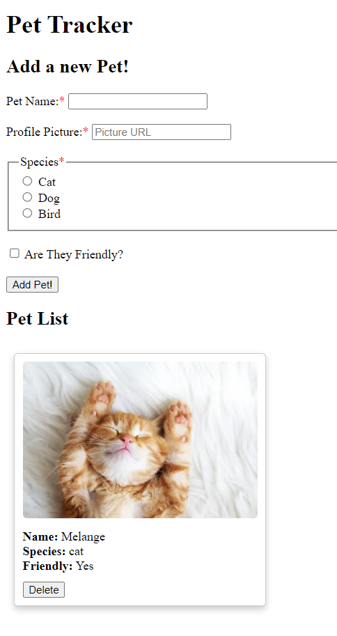

# Pet Tracker

After attempting to use MongoDB, I reverted to using localStorage to get a functional application. I suspect I am missing something small for MongoDB to work.

# Sources Used
- [Adevait](https://adevait.com/nodejs/build-a-crud-app-with-only-json-files)
- [Express](https://expressjs.com/en/guide/database-integration.html)
- [GeeksforGeeks](https://www.geeksforgeeks.org/mongodb-crud-operations/)
- [GitHub](https://docs.github.com/en/enterprise-cloud@latest/codespaces/setting-up-your-project-for-codespaces/adding-a-dev-container-configuration/setting-up-your-nodejs-project-for-codespaces)
- [Medium](https://medium.com/@nutanbhogendrasharma/connect-to-mongodb-in-express-project-part-2-3644b7349096)
- [MongoDB](www.mongodb.com)
- [W3Schools](https://www.w3schools.com/jsref/prop_win_localstorage.asp)
- [YouTube](https://www.youtube.com/watch?v=EUHlm0leMM0)

# Screenshot
